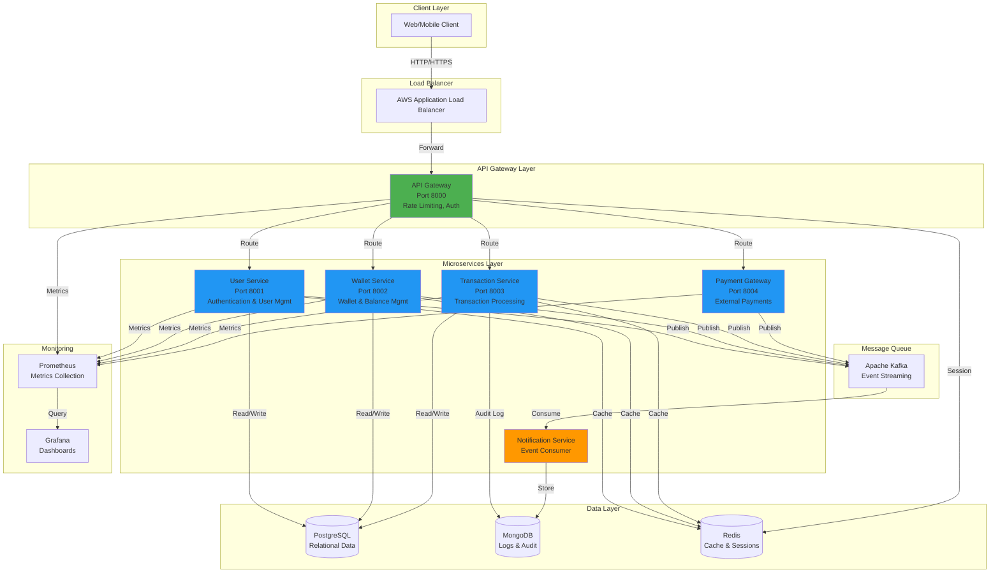

# Payment System - Architecture Documentation

## System Architecture Overview



## Technology Stack

### Backend Framework
- **FastAPI**: Modern, high-performance Python web framework
- **Python 3.11**: Latest stable Python version
- **Uvicorn**: ASGI server for production deployment

### Databases
- **PostgreSQL 15**: Primary relational database for transactional data
- **MongoDB 7**: Document database for audit logs and unstructured data
- **Redis 7**: In-memory cache for sessions and frequent queries

### Message Queue
- **Apache Kafka**: Distributed event streaming platform
- **Zookeeper**: Coordination service for Kafka

### API Gateway
- **Custom FastAPI Gateway**: Request routing, rate limiting, authentication
- **JWT**: Token-based authentication
- **Redis**: Rate limiting storage

### Monitoring & Observability
- **Prometheus**: Metrics collection and time-series database
- **Grafana**: Visualization and alerting dashboards
- **CloudWatch**: AWS native monitoring (when deployed on AWS)

### Containerization
- **Docker**: Container runtime
- **Docker Compose**: Local multi-container orchestration

### Cloud Infrastructure (AWS)
- **ECS (Elastic Container Service)**: Container orchestration
- **ECR (Elastic Container Registry)**: Docker image registry
- **RDS**: Managed PostgreSQL database
- **ElastiCache**: Managed Redis cluster
- **Application Load Balancer**: Traffic distribution
- **CloudWatch**: Logging and monitoring
- **Auto Scaling**: Dynamic scaling based on metrics

### CI/CD
- **GitHub Actions**: Automated testing and deployment
- **Terraform**: Infrastructure as Code
- **AWS CLI**: Deployment automation

## Microservices Architecture

### 1. User Service
**Responsibilities:**
- User registration and authentication
- Profile management
- JWT token generation and validation
- User verification

**Database:** PostgreSQL (users table)
**Cache:** Redis (user sessions, user data)
**Events Published:**
- user.registered
- user.logged_in
- user.verified
- user.updated

### 2. Wallet Service
**Responsibilities:**
- Wallet creation and management
- Balance tracking
- Fund operations (add/deduct)
- Multi-currency support

**Database:** PostgreSQL (wallets table)
**Cache:** Redis (wallet balances)
**Events Published:**
- wallet.created
- wallet.funds_added
- wallet.funds_deducted
- wallet.deactivated

### 3. Transaction Service
**Responsibilities:**
- Transaction creation and processing
- Transfer orchestration
- Transaction history
- Audit logging

**Database:** PostgreSQL (transactions table)
**Audit Log:** MongoDB (transaction_logs collection)
**Cache:** Redis (transaction data)
**Events Published:**
- transaction.created
- transaction.completed
- transaction.failed

### 4. Payment Gateway Service
**Responsibilities:**
- External payment processing
- Payment method integration (simulated)
- Refund processing
- Payment status tracking

**Events Published:**
- payment.processed
- payment.failed
- payment.refunded

### 5. Notification Service
**Responsibilities:**
- Email notifications
- SMS notifications (simulated)
- Push notifications (simulated)
- Event-driven notification dispatch

**Database:** MongoDB (notifications collection)
**Events Consumed:**
- All events from other services

### 6. API Gateway
**Responsibilities:**
- Request routing to microservices
- JWT authentication
- Rate limiting (100 req/min per IP)
- Request/response logging
- Service health monitoring

## Data Flow

### Transaction Processing Flow
1. Client sends request to API Gateway
2. API Gateway validates JWT token
3. API Gateway checks rate limits
4. Request routed to appropriate service
5. Service processes request
6. Database operations performed
7. Events published to Kafka
8. Response cached in Redis
9. Response returned to client
10. Notification Service consumes events
11. Metrics collected by Prometheus

## Security Features

### Authentication & Authorization
- JWT-based authentication
- Token expiration (60 minutes for access, 7 days for refresh)
- Password hashing with bcrypt
- Role-based access control (User, Merchant, Admin)

### Data Security
- HTTPS/TLS for all communications
- Database encryption at rest
- Sensitive data masking in logs
- SQL injection prevention (SQLAlchemy ORM)

### Rate Limiting
- Per-IP rate limiting (100 requests/minute)
- Redis-based distributed rate limiting
- 429 Too Many Requests response

### API Security
- CORS configuration
- Request validation with Pydantic
- Input sanitization
- Error handling without information leakage

## Scalability Strategy

### Horizontal Scaling
- **ECS Auto Scaling**: Based on CPU/Memory metrics
- **Min Replicas**: 2 per service
- **Max Replicas**: 10 per service
- **Target CPU**: 70%
- **Target Memory**: 80%

### Database Scaling
- **PostgreSQL**: Read replicas for read-heavy operations
- **MongoDB**: Sharding for large audit log collections
- **Redis**: Cluster mode for high availability

### Caching Strategy
- User data: 30 minutes TTL
- Wallet data: 5 minutes TTL
- Transaction data: 10 minutes TTL
- Rate limit data: 1 minute TTL

## High Availability

### Service Redundancy
- Multiple replicas of each service
- Health checks on all services
- Automatic container restart on failure

### Database Redundancy
- PostgreSQL: Multi-AZ deployment on RDS
- MongoDB: Replica sets
- Redis: Multi-node cluster with automatic failover

### Load Balancing
- Application Load Balancer for traffic distribution
- Health check endpoints on all services
- Automatic removal of unhealthy targets

## Monitoring & Alerting

### Metrics Collected
- Request count and latency
- Error rates
- CPU and memory usage
- Database connection pool stats
- Cache hit/miss rates
- Kafka lag

### Alerts
- Service downtime
- High error rates (> 5%)
- High latency (> 1s p95)
- Database connection errors
- Memory usage > 90%
- Disk usage > 85%

## Deployment Architecture

### Local Development
```
docker-compose up
```
All services, databases, and monitoring tools run in Docker containers

### AWS Production Deployment
```
1. Terraform provisions infrastructure
2. ECR stores Docker images
3. ECS runs containerized services
4. RDS hosts PostgreSQL
5. ElastiCache hosts Redis
6. MSK or self-managed Kafka
7. CloudWatch for logging
8. ALB for load balancing
```

### CI/CD Pipeline
```
1. Code push to GitHub
2. GitHub Actions triggered
3. Run tests and linting
4. Build Docker images
5. Push to ECR
6. Update ECS task definitions
7. Deploy to ECS
8. Run smoke tests
```

## Cost Optimization

### AWS Cost Estimates (Monthly)
- ECS Tasks (6 services, 2 replicas): ~$150
- RDS PostgreSQL (db.t3.micro): ~$15
- ElastiCache Redis (cache.t3.micro): ~$15
- ALB: ~$20
- Data Transfer: ~$50
- CloudWatch Logs: ~$10
**Total**: ~$260/month (development environment)

### Production Optimization
- Use Reserved Instances for predictable workloads
- Implement auto-scaling to reduce costs during low traffic
- Use S3 for long-term log storage
- Optimize database queries and indexes
- Implement connection pooling

## Disaster Recovery

### Backup Strategy
- PostgreSQL: Daily automated backups, 7-day retention
- MongoDB: Continuous backup with point-in-time recovery
- Configuration: Version controlled in Git

### Recovery Procedures
- RTO (Recovery Time Objective): 1 hour
- RPO (Recovery Point Objective): 5 minutes
- Automated failover for all critical components
- Regular disaster recovery drills

## Performance Benchmarks

### Expected Performance
- API Gateway: 1000+ req/sec
- User Service: 500 req/sec
- Wallet Service: 500 req/sec
- Transaction Service: 300 req/sec
- Average Latency: < 100ms (p95)
- Cache Hit Rate: > 80%

### Load Testing Results
Run with Apache JMeter or Locust:
- 10,000 concurrent users
- 100,000 requests/minute
- 99.9% success rate
- p95 latency: 150ms
