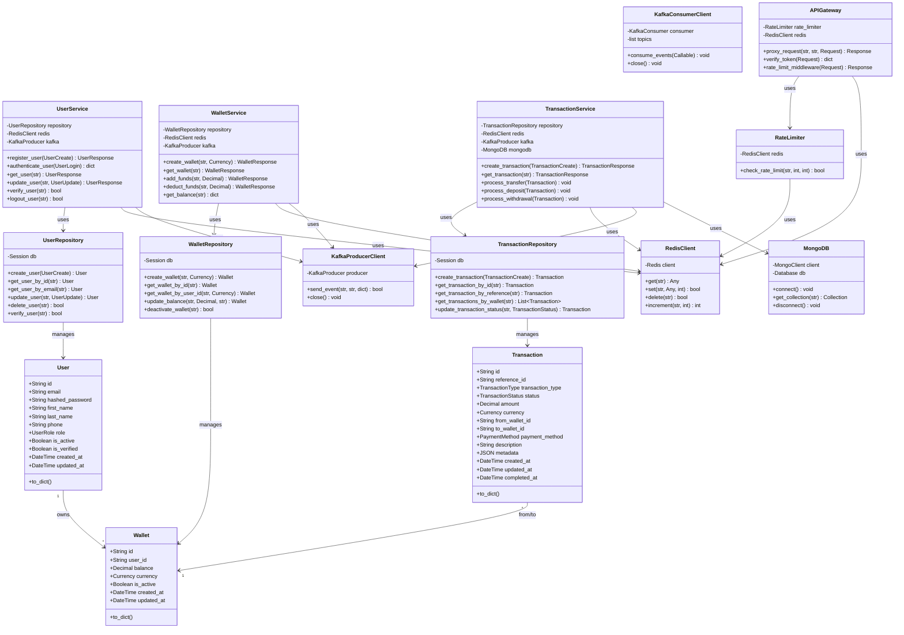

# Payment System - Class Diagram

## Entity Relationships

### User ↔ Wallet
- One user can have multiple wallets (different currencies)
- Each wallet belongs to exactly one user

### Wallet ↔ Transaction
- Transactions can involve one or two wallets
- Each transaction references source and/or destination wallet

### Service Dependencies
- All services use RedisClient for caching
- All services use KafkaProducerClient for event streaming
- Transaction Service additionally uses MongoDB for audit logging
