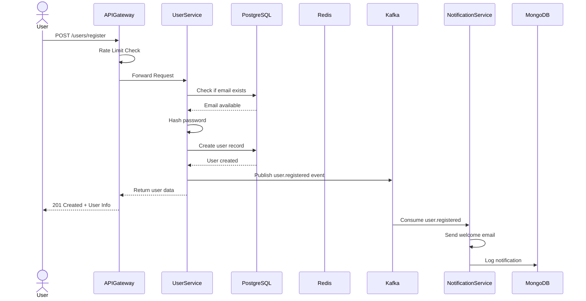
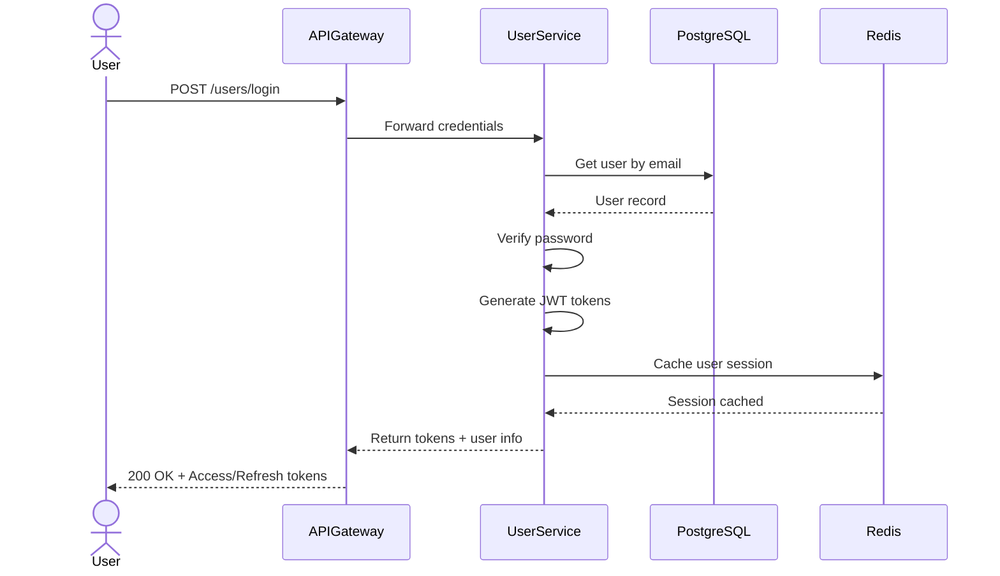
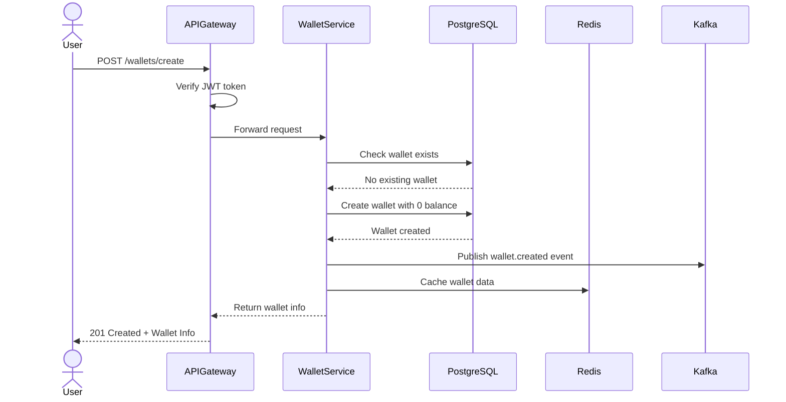
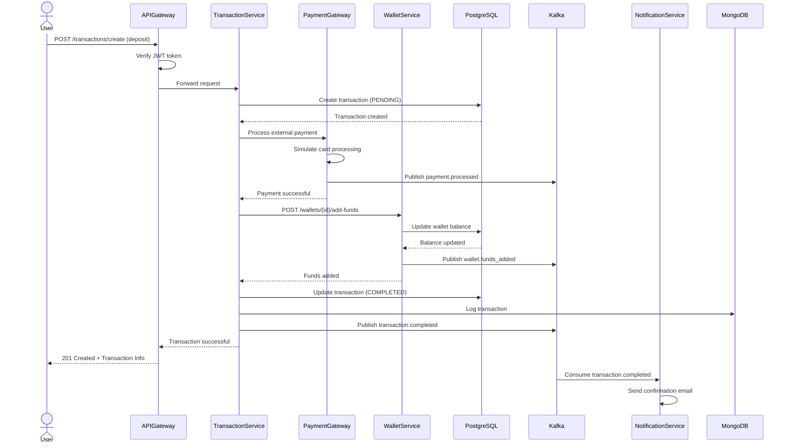
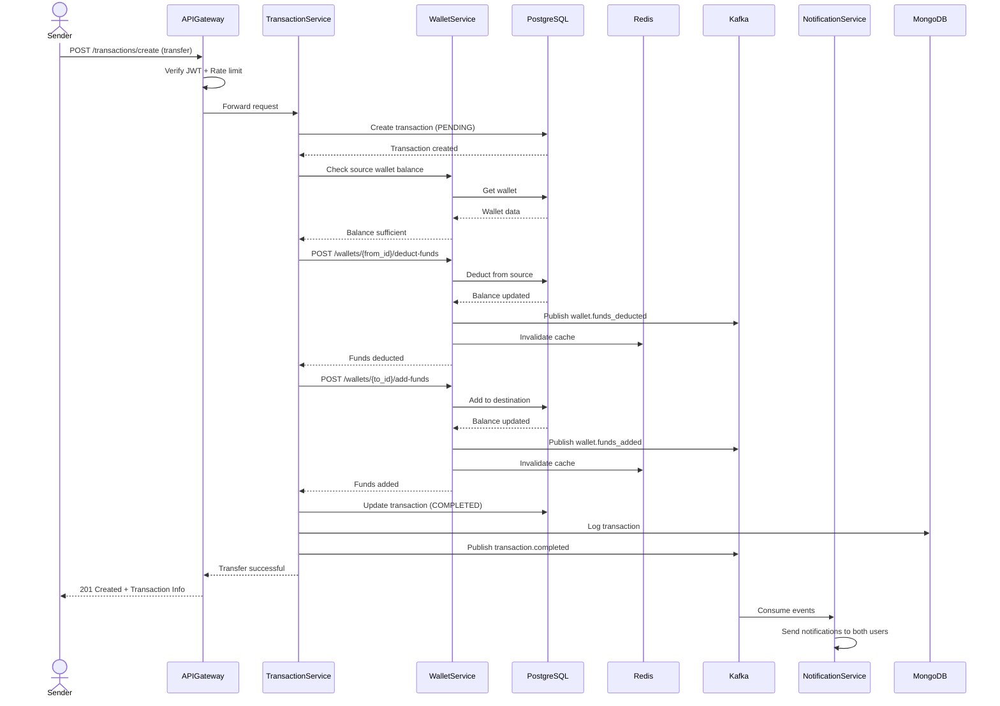
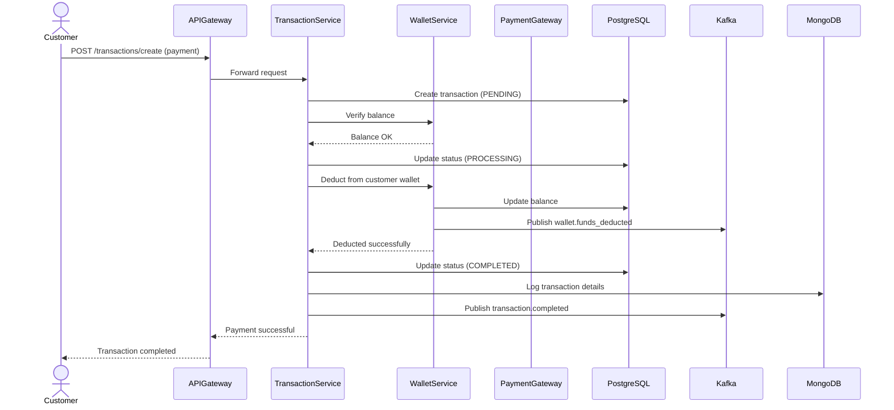
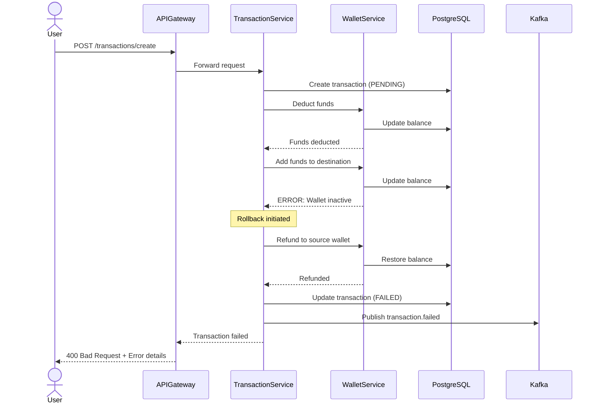
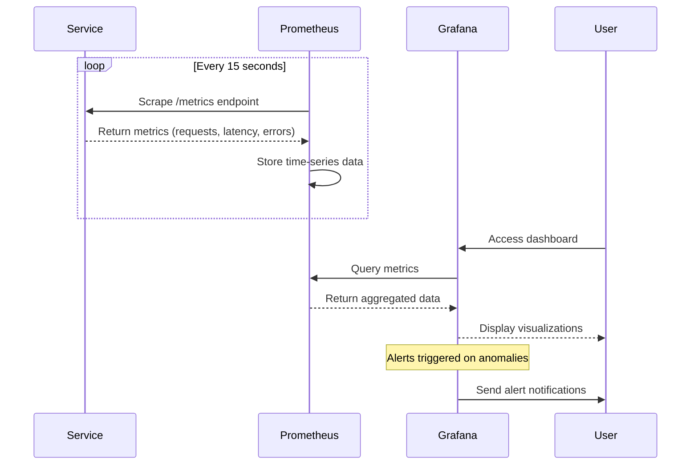

# Payment System - Sequence Diagrams

## 1. User Registration Flow

## 2. User Authentication Flow

## 3. Wallet Creation Flow

## 4. Fund Deposit Flow

## 5. Wallet-to-Wallet Transfer Flow

## 6. Payment Processing Flow

## 7. Transaction Failure and Rollback Flow

## 8. Monitoring and Metrics Collection Flow

## Key Flow Characteristics

### Reliability
- All critical operations are logged to MongoDB for audit trails
- Failed transactions trigger rollback mechanisms
- Events are published to Kafka for asynchronous processing

### Performance
- Redis caching reduces database load
- Asynchronous event processing via Kafka
- Rate limiting prevents system overload

### Security
- JWT token verification on all protected endpoints
- Rate limiting per client IP
- Sensitive data encrypted in transit and at rest

### Observability
- Prometheus metrics collection from all services
- Grafana dashboards for real-time monitoring
- Structured logging for troubleshooting
